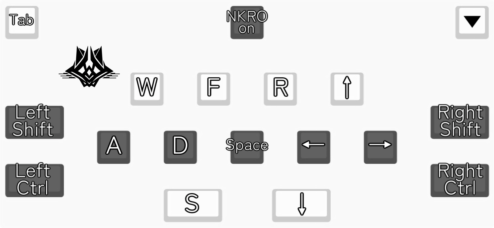

# RGK v1.0　Manual

## ※Sorry.This is machine translated. If you have any questions, please contact us.

## Introduction

Thank you for purchasing "RGK Controller".

This will be the first product we manufacture and sell, so we are not sure how well we will do in some areas, but we appreciate your cooperation.

Please read the following notes and explanations carefully, as there may be some parts that are difficult to understand, such as the key layout.

We sincerely hope you enjoy your sound game life on your PC!

## precautions

These products are handmade.
Soldering, programming, and operation checks are done by hand, so the quality may be inferior to products made by companies, or the quality may vary from product to product.

Please note that there may be some minor scratches or stains on the acrylic or PCB (circuit board), but it is difficult to ensure that there are no scratches as they are sometimes attached when the product arrives from the factory.

Of course, items that are determined to have major scratches or stains are played at the inspection stage.
 
 
- Please handle the product with care, as some parts are sharp or fragile.
- Changes to the current key arrangement will not be supported.

Although we inspect the products as much as possible, please be sure to confirm that there are no initial defects by following the procedures below before assembly.

If you find any defects, please contact the place of purchase within one week after receiving the product.

1. Check the acrylic part for cracks.
2. If a screw or keycap is removed, reattach it. *Do not tighten screws too tightly. The acrylic will break.
3. After connecting to the PC and installing the driver, check if all supported keys are recognized by [keyboardchecker](https://keyboardchecker.com/).

### Terms of Use

You are free to publish images and videos of the keyboard.

Please be generous with the use of video games and videos of your hand in action, as it is good for publicity.

The following are prohibited
- No diversion of designs, designs, or logos
- Prohibition of secondary use of modified designs and logos
- Prohibition of use against public order and morals

If you have any questions, please contact us.

## How to Use

### Connection method

The driver is automatically installed when this product is connected to a PC. (Device name "RGK V1.0")

When the product is connected to a PC, the connection is successful if the red Promicro LED in the upper right corner of the product is lit.

If it blinks or otherwise, the connection may not be working properly.

If the device does not respond or is unstable when connected, please refer to the manual for the solution.

### Key Maps

The key layout is as shown in the image below.

While holding down the key with the ▽ in the upper right corner, the key sequence switches to the key sequence in the second image.

#### Key Map1

#### Key Map2　※Only while holding down the upper right key

 
 
### Replacement of key switches and key caps

#### Remove
- Key Switch

  The key switch section is hot-swappable, allowing easy replacement of switches without soldering.

　　We recommend using a key switch puller to remove the switch, but it can also be removed with bare hands.

　　When removing the device, be sure to pull it straight out, not at an angle.

　　When removing it with bare hands, hold the switch firmly and pull it straight out, being careful not to do so at an angle.

  

- Key Cap

  Pull straight out with bare hands.

  If the switch falls out together, pull out the keycap part while holding the switch.

#### Mounting
- Key Switch

　Check the position of the foot of the switch and the hole in the board carefully, and insert the switch straight into the board so that it is facing the right direction.

　It does not snap into place, so as long as the switch is firmly hooked up to the acrylic plate, you should be fine.

　The legs of the switch are very easily bent, so handle with care. If they are slightly skewed, straighten them before inserting them.

 

- Key Cap

  There is no particular orientation, so insert the cap straight into the switch, aligning the hole in the switch with the foot of the cap.

## When you are in trouble

### Unable to connect, unresponsive

Please try the following steps, one at a time from the top.

If you have taken all the steps and the problem has not been resolved, please contact us.

#### ・LEDs do not light properly. If the driver does not install
1. Re-plug the USB for each product and PC.
2. Plug it back into a different USB port.
3. If you are using the supplied cable, try using a different cable.
4. Restart the PC with the product disconnected from the PC and then try connecting it.

#### ・Normal recognition but no response. If the response is not correct
1. Re-plug the USB for each product and PC.。
2. Plug it back into a different USB port.
3. Restart the PC with the product disconnected from the PC and then try connecting it.
4. If you are using the supplied cable, try using a different cable.

### Keys do not respond when four or more keys are pressed simultaneously.
Press "NKRO on" (see key map 2) once in the upper center while holding down "▽" in the upper right corner of the keyboard.

Once pressed, N-key rollover is enabled and simultaneous presses of all keys will also respond.

If it was not activated, please retry the above steps again.

## Components and Accessories

|name of product|quantity|note|
|:--|:--|:--|
|Acrylic plate (top side)|one sheet||
|Acrylic plate (bottom side)|one sheet||
|PCB(Board)|one sheet||
|spacer (M2x5 mm)|6pcs.||
|M2x5 truss countersunk screw steel|12pcs.||
|Pro micro Type-C|1pcs.|MEGA32U4-MU|
|Diode|18pcs.|1N4148|
|Kailh Choc V1 Red Low-profile.|18pcs.||
|Kailh Choc Switch Sockets|18pcs.||
|Chocfox CFX Keycaps for Choc Switch 1U |6pcs.|Black|
|Chocfox CFX Keycaps for Choc Switch 1U |6pcs.|White|
|Chocfox CFX Keycaps for Choc Switch 1.75U |4pcs.|Black|
|Chocfox CFX Keycaps for Choc Switch 1.75U |2pcs.|White|
|Kailh Choc V1 Red Low-profile.|18pcs.||
|Rubber feet|4pcs.|Accessory|
|USB2.0 Type-C cable 1.5m|1pcs.|Accessory|

## Disclaimer

The producer is not responsible for any problems or trouble that may occur when using this keyboard.

Use at your own risk.

## Credit, contact information
- Design Manufacturing　@teitoki 

[Twetter](https://twitter.com/teitoki) / Mail→teitoki0977@yahoo.co.jp

- Logo & Silk Design @GasuGuma
