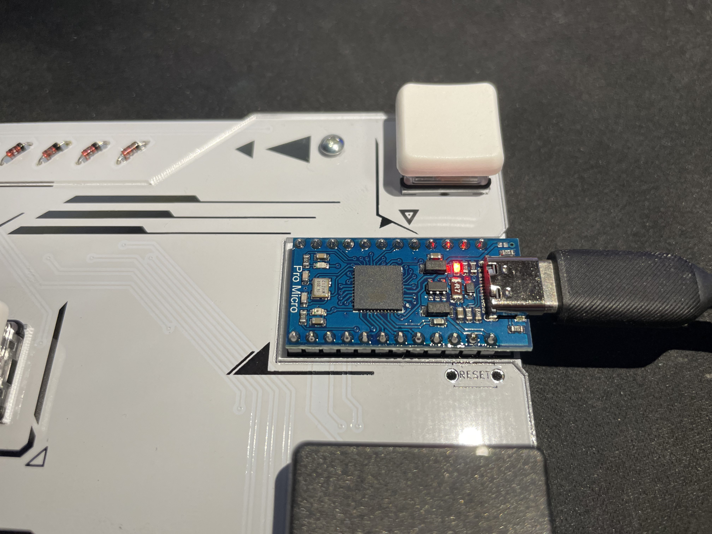

# RGK v1.0　マニュアル

## はじめに

この度は『RGK Controller』をお買い上げ頂き誠にありがとうございます。

初の製造、販売品になりますので拙い部分もあると思いますがよろしくお願いします。

キー配列など、分かりづらい部分もあると思いますので下記の注意事項、説明をしっかり見ていただきますようお願い致します。

あなたがPCでの音ゲーライフを楽しめることを心より願っております！

## 注意事項

こちらの製品はあくまでもハンドメイド品です。
はんだ付やプログラムの書き込み、動作確認は手作業で行っておりますので、企業様が作られているような製品よりも品質が劣っていたり製品ごとに品質がバラついたりします。

アクリルやPCB(基板)に細かな傷がついていたり多少の汚れがある場合がございますが、工場から届いた時点で付いている事もあり傷一つない状態というのも難しいことがございますのでご了承ください。

もちろん大きな傷や汚れがあると判断した物は検品の段階で弾いています。
 
 
- 製品には一部鋭利なパーツや壊れやすいパーツがありますので、注意して扱ってください．
- 現状キー配列の変更はサポート外とさせていただきます。

検品は可能な限り行っておりますが、組立前に必ず以下の手順で初期不良のないことを確認してください。

不具合が見つかった場合、お手数ですが商品到着後1週間以内に購入先へご連絡ください.

1. アクリル部分が割れていないか確認する。
2. ネジやキーキャップが取れている場合は付け直す。※ネジはきつく締めすぎないようにしてください。アクリルが割れます。
3. PCに接続し、ドライバーがインストールされた後[keyboardchecker](https://keyboardchecker.com/)で対応している全てのキーが認識されているかを確認する。

### 利用規約

キーボードの画像や動画の公開はご自由にしていただいて大丈夫です。

ゲーム実況や動画で手元を撮影などの利用は宣伝にもなるのでガシガシやってください。

下記は禁止致します。
- 設計、デザイン、ロゴの流用の禁止
- デザイン、ロゴを改変した物の二次利用の禁止
- 公序良俗に反する利用の禁止

わからないことがあればお問い合わせください。

## 使い方

### 接続方法

本製品はPCに接続すると自動でドライバがインストールされます。(デバイス名「RGK V1.0」)

製品とPCを接続した際に、製品右上のPromicroの赤いLEDが点灯していれば正常に接続できています。

点滅やそれ以外の場合は正常に接続できていない可能性がございます。

接続しても反応しない、動作が不安定という場合はマニュアル上に対処法を書いておきますので、そちらをご確認ください。

### キーマップ

下記の画像の通りのキー配列となっております。

右上の▽のキーを長押ししている間、画像２枚目のキー配列に切り替わります。

#### キーマップ1

#### キーマップ2　※右上のキーを長押ししている間のみ

 
 
### キースイッチ、キーキャップの交換

スイッチ　Kailh Choc専用
キーキャップ　Kailh Choc互換

#### 外す時
- キースイッチ

  キースイッチ部はホットスワップに対応しているため、はんだ付け不要で簡単にスイッチを交換することが可能となっております。

　　スイッチを外す際はキースイッチプラーを使うことを推奨しますが、素手でも外すことは可能です。

　　外す際は必ず斜めに引き抜かず、まっすぐ引き抜く様にしてください。

　　素手で外す際はスイッチをしっかり持って斜めにならないように気を付けてまっすぐ引き抜いてください。

  

- キーキャップ

  素手でまっすぐ引き抜いてください。

  スイッチが一緒に抜けてしまう場合は、スイッチを抑えながらキーキャップ部分を抜きぬいてください。

#### 付ける時
- キースイッチ

　スイッチの足と基板の穴の位置をしっかり確認し、向きを間違わない様にまっすぐ差し込んでください。

　カチッっとはまるわけではないので、スイッチがアクリル板までしっかりハマっていれば大丈夫です。

　スイッチの足は非常に曲がりやすいため扱いには気を付けてください。多少斜めになっている場合はまっすぐに直してから差し込んでください。

 

- キーキャップ

  特に向きはございませんので、スイッチの穴とキャップの足を合わせてまっすぐ差し込んでください。

## 困ったとき

### 接続できない、反応しない

下記の手順を上から１つずつお試しください。

すべての対処をしても問題が解決しなかった場合はお手数ですがお問い合わせください

#### ・LEDが正常に点灯しない。ドライバーがインストールされない場合
1. 製品、PCそれぞれのUSBを差し直す
2. 違うUSBポートに差し直す
3. 付属のケーブルを使っている場合は別のケーブルを使ってみる。
4. 製品をPCから外した状態でPCを再起動し、その後接続してみる。

#### ・正常に認識しているが反応しない。反応がおかしい場合
1. 製品、PCそれぞれのUSBを差し直す。
2. 違うUSBポートに差し直す。
3. 製品をPCから外した状態でPCを再起動し、その後接続してみる。
4. 付属のケーブルを使っている場合は別のケーブルを使ってみる

### キーの同時押しが4つ以上の時反応しない
キーボード右上の「▽」を押しながら中央上の「NKRO on（キーマップ2参照)」を１回押してください。

一度押したらNキーロールオーバーが有効になり、全てのキーの同時押しも反応するようになります。

有効にならなかった場合はもう一度上記手順をやり直してください。

## 構成パーツと付属品

本体サイズ　276mm×124mm×20mm(キーキャップ含む)

|品名|数量|備考|
|:--|:--|:--|
|アクリルプレート（天面）|1枚||
|アクリルプレート（底面）|1枚||
|PCB（基板）|1枚||
|スペーサー (M2x5 mm)|6個||
|M2x5 トラス小ねじ steel|12個||
|Pro micro Type-C|1個|MEGA32U4-MU|
|ダイオード|18個|1N4148|
|Kailh Choc V1 Red ロープロファイル|18個||
|Kailh Choc Switch ソケット|18個||
|Chocfox CFX Keycaps for Choc Switch 1U |6個|Black|
|Chocfox CFX Keycaps for Choc Switch 1U |6個|White|
|Chocfox CFX Keycaps for Choc Switch 1.75U |4個|Black|
|Chocfox CFX Keycaps for Choc Switch 1.75U |2個|White|
|Kailh Choc V1 Red ロープロファイル|18個||
|ゴム足|4個|付属品|
|USB2.0 Type-C ケーブル 1.5m|1個|付属品|

## 免責事項

当キーボードの利用にあたって、何らかの不具合やトラブルが生じたとしても製作者一同一切の責任を負いません。

自己責任でご利用ください。

## クレジット、お問い合わせ先
- 設計 製造　@teitoki 

[Twetter](https://twitter.com/teitoki) / Mail→teitoki0977@yahoo.co.jp

- ロゴ&シルクデザイン @GasuGuma
