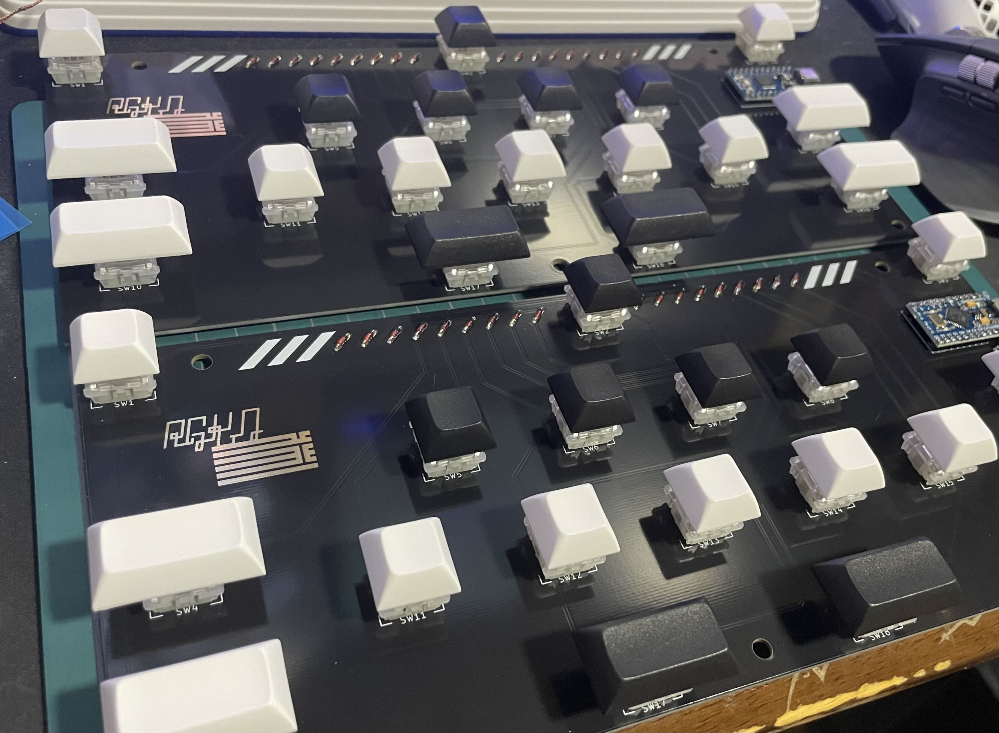

# RGK v1.0　マニュアル

## はじめに

この度は『RGK Controller』をお買い上げ頂き誠にありがとうございます。

初の製造、販売品になりますので拙い部分もあると思いますがよろしくお願いします。

キー配列等分かりづらい部分もあると思いますので、下記の注意事項、
説明をしっかり見ていただきますようお願い致します。

これから、あなたがPCでの音ゲーライフを楽しめることを心より願っております！

## 使用上の注意

こちらの製品があくまでも個人製作品です。
はんだ付やプログラムの書き込み、動作確認は手作業で行っておりますので、企業様が作られているような製品よりも品質が劣っていたり製品ごとに品質がバラついたりします。

アクリルやPCB(基板)に細かな傷がついていたり多少の汚れがある場合がございますが、工場から届いた時点で付いている事もあり傷一つない状態というのも難しいことがございますのでご了承ください。

もちろん大きな傷や汚れがあると判断した物は検品の段階で弾いています。
 
 
- 製品には一部鋭利なパーツや壊れやすいパーツがありますので、注意して扱ってください．
- まことに申し訳ありませんが、現状キー配列の変更はサポート外とさせていただきます。

検品は可能な限り行っておりますが、組立前に必ず以下の手順で初期不良のないことを確認してください。

不具合が見つかった場合、お手数ですが商品到着後1週間以内に購入先へご連絡ください.

1. アクリル部分が割れていないか確認する。
2. ネジやキーキャップが取れている場合は付け直す。
3. PCに接続し、ドライバーがインストールされた後[keyboardchecker](https://keyboardchecker.com/)で対応している全てのキーが認識されているかを確認する。
